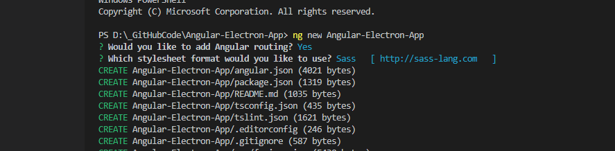
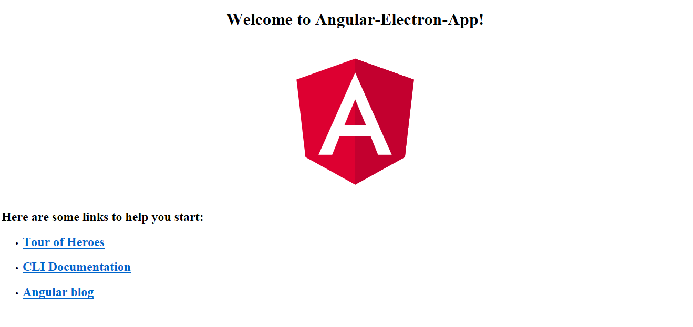

# Getting Started

The first step if you haven't done so already is to install [Angular CLI]("https://cli.angular.io/"), run:

`npm install ‐g @angular/cli`

from the VS Code terminal.

The next step is to create ourselves a new angular application. This can be done by running the following from the root of your project directory:

`ng new Angular-Electron-App`

You will see some along the lines of the image below:

Now browse to your app folder:

`cd Angular-Electron-App`

If you desire you can test that the angular project loads by typing in:

`ng serve`

With any luck you will be presented with a view similar to this when you view http://localhost:4200 in a brwoser.

After we are sure the app is running successfully why don't we install the Electron library.

`npm install electron --save-dev`